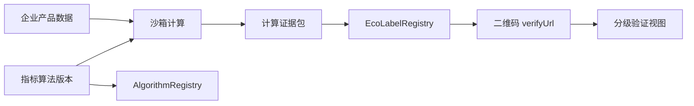

# 生态设计数字标识可信计算 MVP

本 MVP
将企业原始产品数据限制在沙箱侧，将区块链用于算法治理、计算证据承诺和标识生命周期，而不是将商业数据上链。

## 安全边界

- `ProductData.attributes`、敏感字段、材料和证明文件均保留在沙箱存储；`LedgerPort`
  的类型不接受这些内容。
- 链上登记算法哈希/状态，以及 `inputHash`、`resultHash`、`evidenceHash`
  和标识状态；没有原始数据或中间值。
- `LocalDeterministicSandbox` 是离线开发和测试实现，明确不是
  TEE。生产环境应换成经过批准的 `TcsSandboxAdapter`
  结果映射实现，并可填入远程证明引用。
- `AntChainLedgerAdapter` 定义了真实调用边界和
  ABI，但不会假称合约已部署。部署时设置 `ECO_ALGORITHM_REGISTRY_CONTRACT` 与
  `ECO_LABEL_REGISTRY_CONTRACT`，并确认 ABI。

默认的 `LocalDeterministicSandbox` 与 `MemoryLedgerAdapter`
仅允许开发/测试。`main` 在 `ENV=production`
时会拒绝用这组默认适配器启动。生产组装必须显式构造
`EcoLabelService(approvedTcsSandbox, deployedAntChainLedger, publicBaseUrl)`，将其传给
`createApp(service, { viewerResolver })`，并提供已验证的 IAM/gateway
resolver；启动编排也应将真实合约名称、TCS 结果 mapper 和回执确认 mapper
设为必填配置。

## 身份与数据查看授权

`/api/eco` 不再信任客户端自报的 `x-viewer-role` 或
`x-enterprise-id`。生产部署必须向 `createApp` 注入 `ViewerResolver`，由 API
网关、企业 IAM、mTLS 身份或已验证 JWT claims 生成
`ViewerContext`。至少传入：主体 ID、角色、企业自身 `enterpriseId`
和合作方可访问的
`authorizedEnterpriseIds`。令牌验签、受众、过期时间和租户隔离必须在 resolver
之前或其中完成。

没有 resolver 时，只有公开验证
API/页面可访问；所有非公开操作都会拒绝，绝不会降级为请求头身份。`DevHeaderViewerResolver`
只用于本地手工测试，且只有 `ENV` 不是 `production` 并显式设置
`ECO_ALLOW_DEV_HEADERS=true` 时服务器才启用。合作方必须在可信 claims
中拥有目标企业的 `authorizedEnterpriseIds`
范围，才能读取分项指标；不能凭角色读取任意企业结果。

## 合约业务语义

`AlgorithmRegistry`：`registerAlgorithm(id, algorithmHash, status)`，`setAlgorithmStatus(id, status)`；应限制算法发布方，并拒绝未启用的版本用于签发。

`EcoLabelRegistry`：`issueLabel(labelId, taskId, algorithmId, inputHash, resultHash, evidenceHash)`，`revokeLabel(labelId, reasonHash)`；应限制签发方、保证
task/label 唯一，并记录状态变更。

内存适配器只用于测试，交易 ID 不代表真实链上交易。当前 AntChain
适配器在未提供部署专用回执映射时返回明确标为 `pending-request-*`
的请求引用，不能作为已确认交易证明。

### 链码交接规范（未在本仓库编译或部署）

链码团队应实现下列状态、事件、权限和幂等规则；它们是部署验收条件，而非本仓库对已部署合约的声明。

| 合约                | 状态与数据                                                                                                                    | 方法、权限和幂等约束                                                                                                                                                                                                   | 必须发出的事件                                      |
| ------------------- | ----------------------------------------------------------------------------------------------------------------------------- | ---------------------------------------------------------------------------------------------------------------------------------------------------------------------------------------------------------------------- | --------------------------------------------------- |
| `AlgorithmRegistry` | 算法 ID、算法哈希、`DRAFT/ACTIVE/SUSPENDED/RETIRED`、发布者、时间戳                                                           | 仅 `ALGORITHM_ADMIN` 可登记或改状态；同一 ID + 哈希重试成功但不得创建第二条记录；不同哈希复用 ID 必须拒绝；`RETIRED` 不可恢复；同一指标体系同一时刻最多一个 `ACTIVE` 版本                                              | `AlgorithmRegistered`、`AlgorithmStatusChanged`     |
| `EcoLabelRegistry`  | label ID、task ID、algorithm ID、input/result/evidence 哈希、`ACTIVE/REVOKED/SUSPENDED/EXPIRED`、签发者、时间戳、撤销原因哈希 | 仅 `LABEL_ISSUER` 可签发，且算法必须 `ACTIVE`；label ID 与 task ID 都全局唯一；相同完整 payload 重试返回原记录；不同 payload 的重复 task/label 必须拒绝；仅 `LABEL_REVOKER` 可撤销；`REVOKED` 不可恢复，须新 task 重签 | `LabelIssued`、`LabelRevoked`、`LabelStatusChanged` |

不得将产品属性、配方、企业证明文件、明文中间分数、个人信息写入事件或状态。链上只接收上述哈希承诺和非敏感标识符。合约还应保存角色授予/撤销审计事件，所有方法校验调用者组织、租户和参数长度/哈希格式。

部署验收清单：

1. 由多组织/多签管理员配置
   `ALGORITHM_ADMIN`、`LABEL_ISSUER`、`LABEL_REVOKER`，并测试未授权调用回滚。
2. 用链上事件和查询分别验证算法登记、启停、签发、重复签发、撤销、重复撤销和跨租户越权。
3. 从真实交易回执提取交易哈希与区块高度，配置适配器回执 mapper；`PENDING`
   不得显示为链上已确认。
4. 比对链上 `inputHash`、`resultHash`、`evidenceHash`
   与沙箱证据包；验证事件中没有原始产品字段。
5. 对升级、暂停、证书轮换和灾备恢复执行演练，保留旧标识的可验证历史。

## HTTP 流程

所有响应为 `{ success, data }`。生产写操作需要可信 `ViewerResolver` 的身份
claims；企业提交时 claims 的 `enterpriseId` 必须与产品 `enterpriseId` 一致。以下
`x-*` 头仅适用于显式启用的本地开发适配器，不能用于生产认证。

1. `POST /api/eco/algorithms`（`admin`/`evaluator`）创建算法。
2. `PATCH /api/eco/algorithms/:id/status`，body `{"status":"ACTIVE"}` 启用算法。
3. `POST /api/eco/evaluations`（`enterprise`/`evaluator`/`admin`）提交
   `{ algorithmId, product }`。
4. `POST /api/eco/evaluations/:taskId/execute`（`evaluator`/`admin`）执行受控计算。
5. `POST /api/eco/evaluations/:taskId/issue`（`evaluator`/`admin`）签发标识。
6. `GET /api/eco/labels/:labelId` 根据 `x-viewer-role` 过滤字段；`public`
   仅返回公开投影。
7. `GET /verify/:labelId` 是二维码可指向的公开 HTML
   页；`GET /api/eco/verify/:labelId` 返回同一公开 JSON。

二维码可使用返回的 `qrPayload`，其中只包含
`labelId`、`verifyUrl`、链名/合约/交易 ID，不包含企业数据。

公开验证页展示标识状态、等级、算法版本、沙箱证据摘要、链上存证状态以及输入/算法/结果/证据四项承诺校验，并单列“链上已确认”。本地
memory ledger 会明确标记为演示；AntChain 的 `PENDING`
请求不会通过链上确认。它证明记录和版本关联；不能单独证明企业最初提交的数据客观真实，仍需来源证明、抽检或第三方审核。
